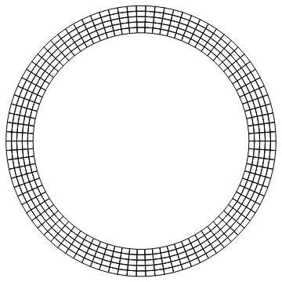
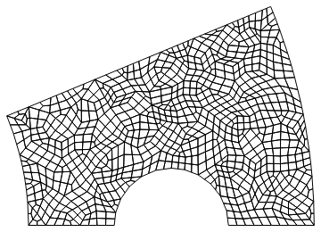

# FEMAddOns for the Wolfram Language

The [Wolfram Language](https://www.wolfram.com/language/) has build in support for the Finite Element Method. FEMAddOns is a package that provides additional Finite Element Method functionality. FEMAddOns supports 11.3 and later versions of Wolfram Language deployments for the desktop, including [Wolfram Desktop](https://www.wolfram.com/desktop/) and [Mathematica](https://www.wolfram.com/mathematica/).

### Installing and Updating the FEMAddOns release

The easiest way to install or update the FEMAddOns is to evaluate the following:

    ResourceFunction["FEMAddOnsInstall"][]

The use of the ResourceFunction requires you to log into your wolfram account. If you can not or do not want to do that then you can install the latest release of the FEMAddOns-X.Y.Z.paclet from the [Github repo's releases page](https://github.com/WolframResearch/FEMAddOns/releases). To install, run the following command in the Wolfram Language:

    PacletInstall["/full/path/to/FEMAddOnsX.Y.Z.paclet"]

Either installation will permanently install the latest version of the FEMAddOns paclet. Installed versions can be enumerated using the command:

    PacletFind["FEMAddOns"]

And all versions can be uninstalled using the command:

    PacletUninstall["FEMAddOns"]

To make use of the documentation it may be necessary to restart.

### Using FEMAddOns

To access the documentation, open the notebook interface help viewer, and search for FEMAddOns. The first hit will be a summary page enumerating the most commonly used functions in FEMAddOns. From there you can also follow the link to *contributed FEM Applications*.

For example generate structured meshes with `StructuredMesh`:

	raster = Table[#, {fi, 0, 2 Pi, 2 Pi/360}] & /@ {{Cos[fi], Sin[fi]}, 0.8*{Cos[fi], Sin[fi]}};
	mesh = StructuredMesh[raster, {90, 5}];
	mesh["Wireframe"]

With `ToQuadMesh` convert triangle meshes into quadrilateral meshes:

	region = ImplicitRegion[And @@ (# <= 0 & /@ {-y, 1/25 - (-3/2 + x)^2 - y^2, 
       1 - x^2 - y^2, -4 + x^2 + y^2, y - x*Tan[Pi/8]}), {x, y}];
	ToQuadMesh[ToElementMesh[region]]["Wireframe"]

Use the `DistMesh` mesh generator to create smooth meshes:

	mesh = DistMesh[RegionDifference[Rectangle[{-1, -1}, {1, 1}], Disk[{0, 0}, 1/2]], 
	   "DistMeshRefinementFunction" -> 
	    Function[{x, y}, Min[4*Sqrt[Plus @@ ({x, y}^2)] - 1, 2]], 
	   "MaxCellMeasure" -> {"Length" -> 0.05}, 
	   "IncludePoints" -> {{-1, -1}, {-1, 1}, {1, -1}, {1, 1}}]; 
	mesh["Wireframe"]

 With `ImportMesh` load meshes from Abaqus, Comsol, Elfen and Gmsh  

	mesh = ImportMesh[ "filePath", "mesh.mphtxt"];
	mesh["Wireframe"]

Use `DomainDecomposition` to solve stationary PDEs on a cluster:

	kernels = LaunchKernels[24];
	DecompositionNDSolveValue[{Laplacian[u[x, y], {x, y}] == 1, 
	  DirichletCondition[u[x, y] == 0, 
	   x == 0 || x == 5 || y == 0 || y == 1]}, u, Element[{x, y}, 
	  Rectangle[{0, 0}, {5, 1}]], "Kernels" -> kernels]

### More...

See the following files for more information:

* [License.md](License.md) - FEMAddOns license
* [Contributing.md](Contributing.md) - Guidelines for contributing to FEMAddOns
* [HowToBuild.md](HowToBuild.md) - Instructions for building and debugging FEMAddOns
* [AlternativeInstallation.md](AlternativeInstallation.md) - Alternative instructions for installing the  FEMAddOns paclet
